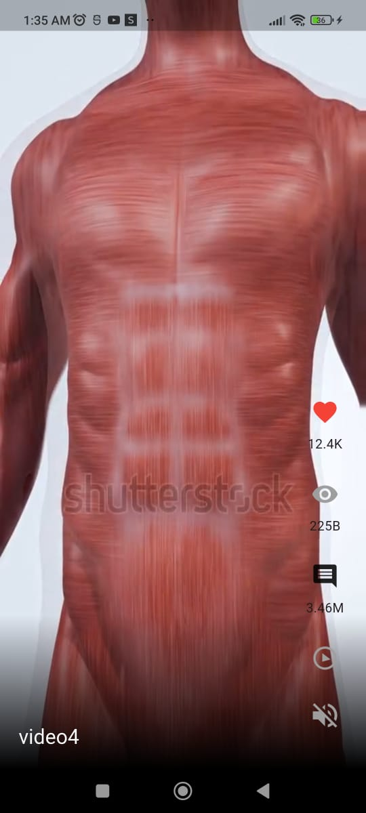
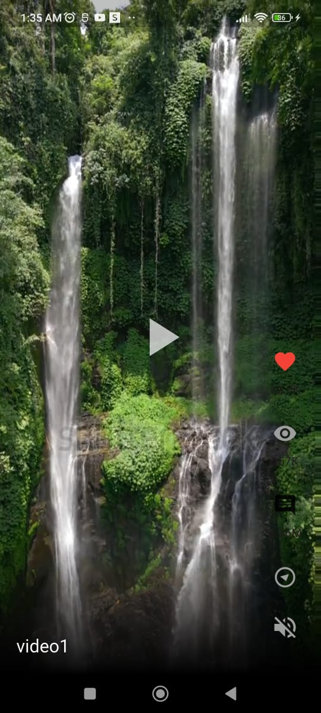
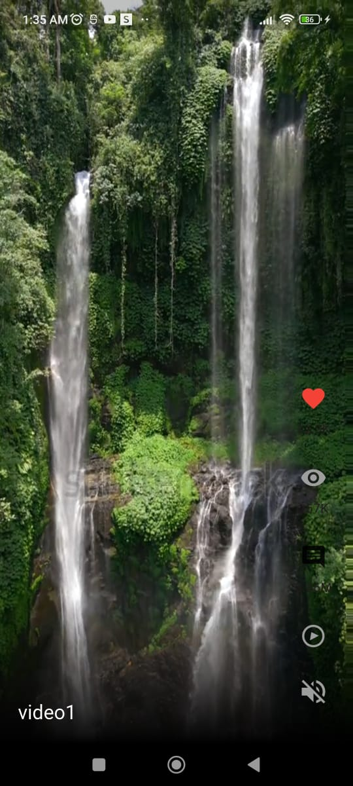
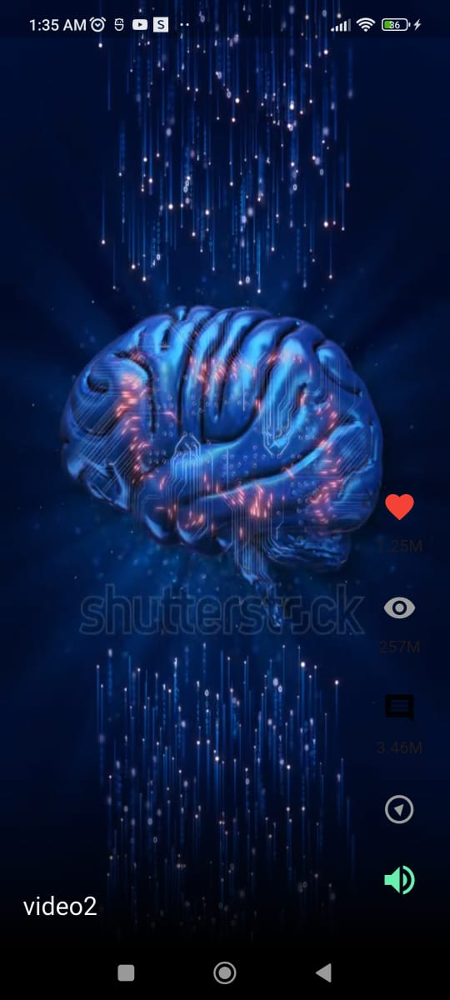
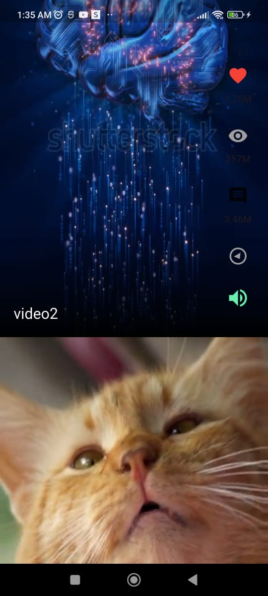

<div align="center">

## 🏫 UNIVERSIDAD TECNOLÓGICA DE XICOTEPEC DE JUÁREZ  
### 👩‍💻 INGENIERÍA EN DESARROLLO Y GESTIÓN DE SOFTWARE  
#### 📚 DÉCIMO CUATRIMESTRE

---

### 📖 MATERIA:  
## **Desarrollo Móvil Integral**

---
### 📖 PRÁCTICA 4:  
## **App de Reproducción de Videos (Stateless y Statefull Widgets)**
---

### ALUMNA:  
## **Jose Luis Campos Marquez**

---

### DOCENTE:  
## **M.T.I. Marco Antonio Ramírez Hernández**

---
# 🎬 Flutter Video Player App

Aplicación Flutter que reproduce videos desde los assets, con funciones
de control de reproducción, volumen, y scroll.\
Incluye un ícono personalizado, pantalla splash, y controles de video
completos.

------------------------------------------------------------------------

## 🚀 Instalación

1.  Clonar el repositorio:

    ``` bash
    git clone https://github.com/tuusuario/flutter_video_app.git
    cd flutter_video_app
    ```

2.  Instalar dependencias:

    ``` bash
    flutter pub get
    ```

3.  Ejecutar la app:

    ``` bash
    flutter run
    ```

------------------------------------------------------------------------

## 🧩 Configuración de assets

Asegúrate de tener la siguiente estructura en tu proyecto:

``` yaml
flutter:
  uses-material-design: true

  assets:
    - assets/videos/
```

------------------------------------------------------------------------

## 📱 Sección de Capturas

### 🔴 Botón de pausa en funcionamiento



### 🟡 Botón de play en funcionamiento



### 🟤 Control de volumen --- Cambio de ícono al silenciar sonido



### ⚪ Control de volumen --- Cambio de ícono al activar sonido



### ⚫ Funcionamiento del scroll en los videos



### 🟣 Vista general con íconos implementados


------------------------------------------------------------------------

## 🧠 Tecnologías utilizadas

-   Flutter 3.x
-   Dart
-   Video Player Plugin
-   Assets locales

------------------------------------------------------------------------

## 👨‍💻 Autor

Desarrollado por **Jose Luis Campos Márquez**
